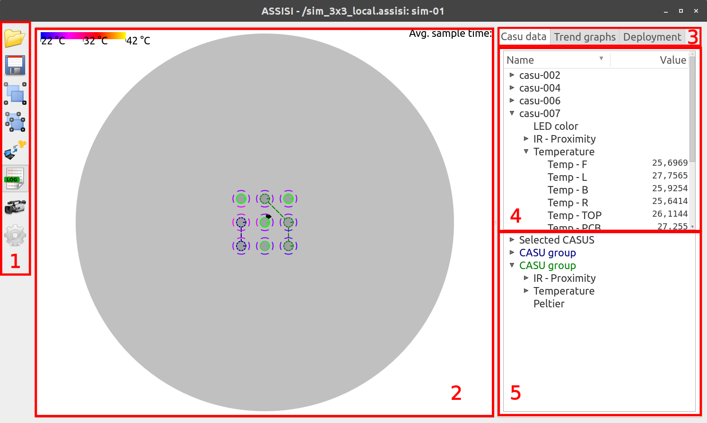

Basic operation
===============

This section describes basic operation of the Arena UI. The program can be started from Ubuntu's Dash menu.

User interface layout
---------------------

The basic layout of the user interface is shown in Figure :ref:`fig_uielem`.

.. _fig_uielem:

    Basic elements of the Arena UI

Most of elements of the Arena UI can be resized with sliders betweem them. If slider is moved close to the edge of some element, that element will be hidden. It can be brought back with moving the slider from edge, revealing the hidden element.

The menu pane
~~~~~~~~~~~~~

The menu pane enables the following basic operations:

  **Open** *(Ctrl+O)*
      Open a *project* (.assisi file), which describes the CASU layout, their connection details, neighborhood definitions and deployment details, or a *session* (.ArenaUI file), which specifies a project and all user interface customizations (e.g. CASU groups, open Trend graphs etc.).
  **Save** *(Ctrl+S)*
      Save a session (.ArenaUI file)
  **Group selected** *(Ctrl+G)*
      Grouped CASUs are treated as atomic GUI elements, i.e., selecting one group member selects the whole group etc. Groupings can be hierarchical.
  **Ungroup selected groups** *(Ctrl+U)*
      Ungroups all selected top level groups.
  **Connect to CASU** *(Ctrl+C)*
      Enables manual specification of connection details for a single CASU;
  **Toggle Log** *(Ctrl+L)*
      Turns logging on or off
  **Settings**
    Opens a menu that enables the user to specify default save locations, trending and logging options and the simulator location.

The arena state visualization area
~~~~~~~~~~~~~~~~~~~~~~~~~~~~~~~~~~

Visualization area represents CASU arena and units with their relative positions in it. User can zoom in/out and scroll with following commands:

  **Zoom in/out** *Ctrl + mouse scroll*

  **Scrolling up/down** *mouse scroll*

  **Scrolling left/right** *Alt + mouse scroll*

    *Fast scrolling is enabled by holding additional* **Shift** *modifier.*

The connection status and sensor values of all CASUs can be visualized, and
actuator setpoints can be provided.

  **Physical position**
    CASUs are visualized at their respective positions (as specified in the .assisi file); Orientation is indicated by a short dash.
  **Selections status**
    Selected CASUs are indicated by a dashed outline, whereas unselected CASUs have a solid outline. A treeview with actuator setpoints and sensor
    values appears in the *Casu data* configuration tab for each selected CASU.
  **Connection status**
    Unconnected CASUs have a red outline, connected CASUs have a green outline.
  **Temperature readings**
    Temperature readings are displayed as circular segments at 2cm distance from the CASU body; They are color-coded, with a colorbar displayed in the top-left corner of the visualization area.
  **Proximity sensor readings**
    Proximity sensor readings are visualized as six triangles radiating out of the CASU body. Size of triangle depends on read proximity value.
  **Diagnostic LED actuator**
    Diagnostic LED state is indicated by the color of the CASU body.
  **Airflow actuator**
    When the airflow actuator is turned on, a shaded circular area is displayed around the CASU body
  **Context menu** *(right mouse click in the arena visualization area)*
    * Toggle marker visability

      - proximity markers

      - temperature markers

      - vibration marker

      - airflow marker

      - avg. sample time

    * Group Selected *(Ctrl+G)*

    * Ungroup selected *(Ctrl+U)*

    * Set connection *(Ctrl+C)*

    * Setpoint *(submenu)*

      - Temperature *(F1)*

      - Vibration *(F2)*

      - Airflow *(F3)*

      - IR Proximity *(F4)*

      - LED *(F5)*

      - VibrationPattern *(F6)*

Configuration tabs
=======
* **Physical position** - CASUs are visualized at their respective
  positions (as specified in the .assisi file); Orientation is
  indicated by a short dash at the front;
* **Selections status** - CASUs are selected by left mouse click;
  selected CASUs are indicated by a solid outline, whereas unselected
  CASUs have a dashed outline; a treeview with actuator setpoints and
  sensor values appears in the *Casu data* configuration tab for each
  selected CASU; *Ctrl-Click* on an CASU toggles its selection state;
* **Connection status** - Unconnected CASUs have a red outline,
  connected CASUs have a green outline;
* **Temperature readings** - Temperature readings are displayed as circular
  segments at 2cm distance from the CASU body; They are color-coded,
  with a colorbar displayed in the bottom-left corner of the
  visualization area;
* **Proximity sensor readings** - Proximity sensor readings are
  visualized as six triangles radiating out of the CASU body;
* **Diagnostic LED actuator** - Diagnostic LED state is indicated by
  the color of the CASU body;
* **Airflow actuator** - When the airflow actuator is turned on, light
  yellow indicators are circling around the CASU body;
* **Vibration actuator** - When the vibration actuator is turned on, a
  light grey waveform is shown circling around the CASU body; Frequency is
  visualized by the number of minima/maxima of the waveform, and
  amplitude is visualized by the speed of motion of the waveform;
* **Context menu** - Activated by right-click in the arena
  visualization area; Enables on/off toggling of sensor
  visualizations, CASU grouping/ungrouping, customizing connection
  settings and providing **actuator setpoints**

CASU state treeview
~~~~~~~~~~~~~~~~~~~
Switching between tabs user has access to different features for monitoring and communication with real CASU units.

  **Casu data**
    Tab is populated with two treeview widgets for monitoring selected CASU units. All numerical values are shown for all sensor values and actuator setpoints.

The *CASU treeview* is shown in the **Casu data Configuration tab**
for selected CASUs. The treeview can be expanded to show numerical
values for all actuator setpoints and sensor values. Several devices
can be selected simultaneously by clicking and dragging on their name
in the treeview. A context menu, accessed by right-clicking on a
device name, enables the plotting of sensor value trends in time, as
described in more detail in :ref:`trends`.

    See :ref:`treeview_link`.

  **Trend graphs**
    In order to monitor the progress of experiments, the User interface has the ability to plot the trends (time responses) all sensor values.

    See :ref:`trends_link`.

  **Deployment**
    
