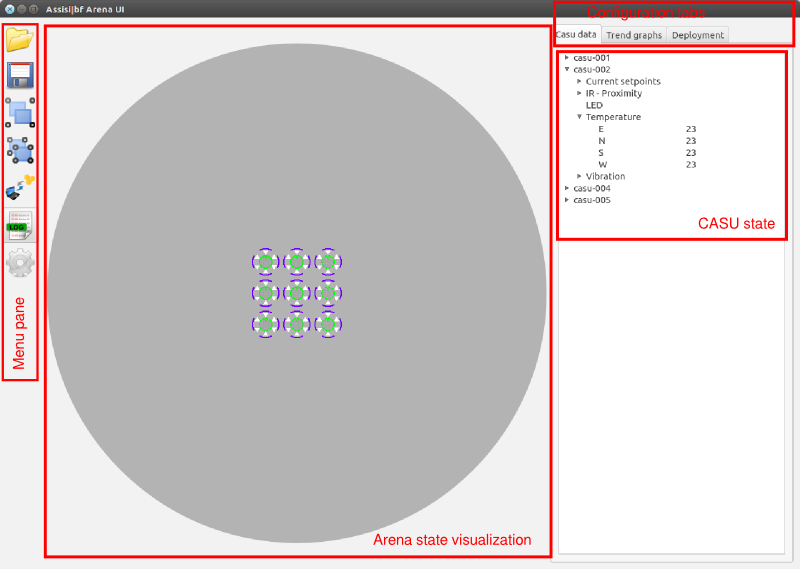

Basic operation
===============

This section describes basic operation of the Arena UI.

User interface layout
---------------------

The basic layout of the user interface is shown in Figure :ref:`fig_uielem`.

.. _fig_uielem:

   Basic elements of the Arena UI.

The menu pane
~~~~~~~~~~~~~

blabla

The arena state visualization area
~~~~~~~~~~~~~~~~~~~~~~~~~~~~~~~~~~

states of all CASUs are visualized...

Configuration tabs
~~~~~~~~~~~~~~~~~~

blabla

CASU state treeview
~~~~~~~~~~~~~~~~~~~

blabla

Loading an arena description file
---------------------------------

blabla

Connecting to CASUs
-------------------

blabla

